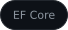
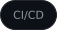
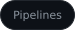
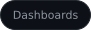
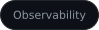
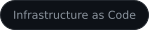
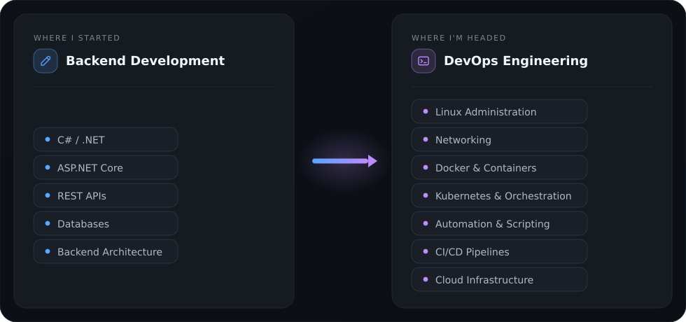

#  Hi there.

<h1 align="center">
  
</h1>

  DevOps Engineer focused on Linux, containers, automation, CI/CD, and cloud infrastructure.

  

  <a href="https://github.com/mustafammasoud">
<<<<<<< Updated upstream
    
  </a>
  
=======
    
  </a>
  
>>>>>>> Stashed changes

---

##  About me

*  Started with **Backend Development & .NET**
*  Currently focused on **Linux & DevOps Engineering**
*  Learning **Docker & Containerization**
*  Building strong foundations in **Networking**
*  Interested in **Automation, CI/CD & Infrastructure**
*  Exploring **Cloud Engineering**
*  I enjoy understanding systems from the application layer down to the infrastructure

My journey started with backend development, building APIs, working with databases, and understanding application architecture.

I'm now expanding that foundation into DevOps Engineering — learning how applications are **built, packaged, deployed, automated, monitored, and operated**.

---

##  Tech stack

<table>
<tr>
<td align="center" width="33%">

### Backend

&nbsp;
&nbsp;
&nbsp;
&nbsp;

</td>

<td align="center" width="33%">

### DevOps &amp; Infrastructure

&nbsp;
&nbsp;
&nbsp;
&nbsp;
&nbsp;

</td>

<td align="center" width="33%">

### Automation

&nbsp;
&nbsp;
&nbsp;
&nbsp;
&nbsp;

</td>
</tr>

<tr>
<td align="center">

### CI/CD &amp; Monitoring

&nbsp;
&nbsp;
&nbsp;
&nbsp;
&nbsp;
&nbsp;

</td>

<td align="center">

### Databases

&nbsp;
&nbsp;
&nbsp;

</td>

<td align="center">

### Cloud &amp; IaC

&nbsp;
&nbsp;
&nbsp;
&nbsp;
&nbsp;
&nbsp;
&nbsp;

</td>
</tr>
</table>

---

##  Core Concepts

  
  
  
  
  
  
  

---

##  Journey

  

I'm not leaving backend behind.

I'm building on top of it to understand the complete software lifecycle — from writing the application to deploying, automating, and operating it in production.

---

##  Current Focus

&nbsp;
&nbsp;

Currently working on:

* Kubernetes fundamentals
* Containerized applications
* Linux administration
* Networking fundamentals
* CI/CD with GitHub Actions
* Infrastructure and automation
* Practical DevOps projects

---

##  Projects I actually use

###  [ops-handbook](https://github.com/mustafammasoud/ops-handbook)

An open-source DevOps knowledge base. Structured docs, labs, cheatsheets and
troubleshooting notes — not a blog. Markdown/MDX in the repo as the source of truth,
Astro for the site, static output ready for Cloudflare Pages.
`Astro` `MDX` `Docs-as-code`

###  [microservices-devops-lab](https://github.com/mustafammasoud/microservices-devops-lab)

An e-commerce demo split into services behind an Nginx load balancer, one container per
service. Built to practice Docker networking, service discovery and realistic compose
setups instead of running a single `docker run`.
`Docker` `Nginx` `Microservices`

###   [dockerized-nodejs-fullstack](https://github.com/mustafammasoud/dockerized-nodejs-fullstack)

Nginx → Node.js → PostgreSQL, three containers on one network. The project where the
proxying, ports and environment variables finally stopped being magic.
`Docker` `Node.js` `PostgreSQL`

###   [server-health-check](https://github.com/mustafammasoud/server-health-check)

A Bash script that SSHes into a list of machines and reports uptime, root disk usage,
memory and failed login attempts. Strict mode, `getopts`, logging, `trap` cleanup —
small, but it forced me to write shell properly.
`Bash` `SSH` `Automation`

###   [task-manager-api](https://github.com/mustafammasoud/task-manager-api)

ASP.NET Core 10 CRUD API with controllers, services and repositories kept strictly
apart, PostgreSQL through EF Core. My reference for how I want back-end code structured.
`C#` `ASP.NET Core` `PostgreSQL`

###  [LifeOS](https://github.com/mustafammasoud/LifeOS)

A cross-platform .NET desktop app for tasks, study sessions, habits, goals, events and
stats. The largest thing I've shipped, and the reason I started caring about releases
and installers.
`C#` `.NET` `Desktop`

---

### Also in the shelf

| Repository | What it is |
| --- | --- |
| [dockerized-flask](https://github.com/mustafammasoud/dockerized-flask) | Minimal Flask app with a Dockerfile, for practising image builds |
| [log-file-analyzer](https://github.com/mustafammasoud/log-file-analyzer) | Python CLI that parses log levels, searches keywords and exports to CSV |
| [lan-chat](https://github.com/mustafammasoud/lan-chat) | Real-time LAN chat in pure Python — raw TCP sockets, no libraries |
| [quran-tracker](https://github.com/mustafammasoud/quran-tracker) | Single-file, offline Arabic web app for tracking memorisation and review |
| [task-manager-api](https://github.com/mustafammasoud/task-manager-api) · [smart-library-api](https://github.com/mustafammasoud/smart-library-api) · [secure-api](https://github.com/mustafammasoud/secure-api) · [crud-project](https://github.com/mustafammasoud/crud-project) | The back-end collection — APIs and CRUD work from when I was learning the basics |

Most of these are small on purpose. They exist to answer one question each, and I'd
rather finish them than leave half a course in a folder.

---

##  GitHub

  
  

---
 ##   Contact Me

  
  
  
  
  

----

   
  <em>Build the application, then go learn what it runs on.</em>

